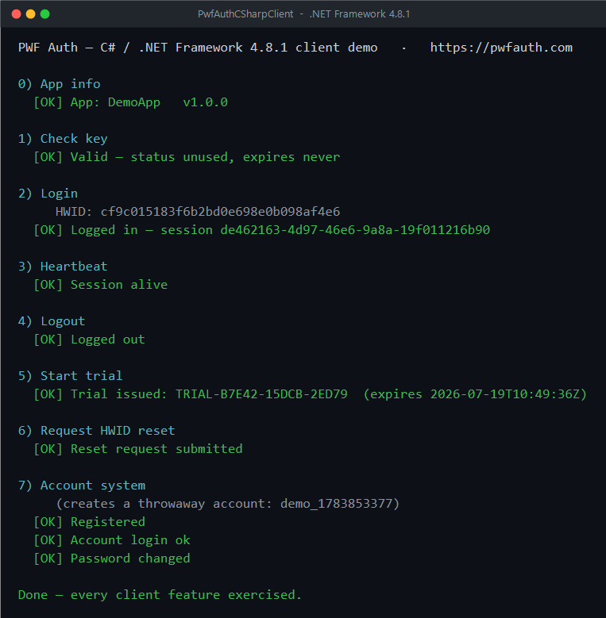

# PwfAuthCSharpClient

A **C# / .NET Framework 4.8.1** console example that exercises **every
client-facing feature** of the [PWF Auth](https://pwfauth.com) API — the same
program as [`PwfAuthConsoleClient`](../PwfAuthConsoleClient) (VB.NET on .NET 8),
ported to C# for legacy **.NET Framework** apps.



## Why a .NET Framework build?

.NET Framework 4.8.1 predates the modern one-shot crypto/JSON helpers, so
`CryptoEnvelope.cs` uses the classic APIs — and stays **byte-for-byte compatible**
with the server's `PayloadCrypto`:

| Modern (.NET 5+) — the VB net8 port | .NET Framework 4.8.1 — here |
| --- | --- |
| `Aes.EncryptCbc` / `DecryptCbc` | `Aes.Create().CreateEncryptor()` + `TransformFinalBlock` |
| `SHA256.HashData` / `HMACSHA256.HashData` | `SHA256.Create().ComputeHash` / `new HMACSHA256(key)` |
| `Convert.ToHexString` | `BitConverter.ToString(...).Replace("-", "")` |
| `System.Text.Json` | `JavaScriptSerializer` (System.Web.Extensions) |
| `CryptographicOperations.FixedTimeEquals` | a small constant-time compare |

The app ships **no NuGet runtime dependencies** — the only package,
`Microsoft.NETFramework.ReferenceAssemblies`, is build-only. It also sets
`ServicePointManager.SecurityProtocol` to TLS 1.2 (older Framework defaults are
rejected by the edge).

## Features demonstrated

| # | Feature | Endpoint | Wire format |
| --- | --- | --- | --- |
| 0 | App info + update check | `GET /api/app/info.php` | encrypted reply |
| 1 | Check a license key | `POST /api/auth/check-key.php` | plain |
| 2 | Login (bind HWID, open session) | `POST /api/auth/login.php` | **encrypted** |
| 3 | Heartbeat (keep alive / kill code) | `POST /api/auth/heartbeat.php` | **encrypted** |
| 4 | Logout | `POST /api/auth/logout.php` | **encrypted** |
| 5 | Start a free trial | `POST /api/auth/trial.php` | plain |
| 6 | Request an HWID reset | `POST /api/auth/request-hwid-reset.php` | plain |
| 7 | Register / login / change-password | `POST /api/auth/account-*.php` | plain |

## Run

```powershell
setx PWF_APP_SECRET "your_app_secret"   # run once (get it from the dashboard)
dotnet run -- PWF-XXXX-XXXX-XXXX          # or run with no argument to be prompted
```

Exit codes: `0` = ran · `1` = missing secret/key · `3` = network error.

Building targets `net481`, so you need the **.NET Framework 4.8.1** developer/targeting
pack (bundled with Visual Studio; `dotnet build` otherwise restores it via the
`Microsoft.NETFramework.ReferenceAssemblies` package).

## Files

| File | Role |
| --- | --- |
| `Program.cs` | The guided demo of all features |
| `PwfAuthClient.cs` | The client — one method per endpoint |
| `CryptoEnvelope.cs` | AES-256-CBC + HMAC-SHA256 envelope (classic Framework APIs) |
| `Hwid.cs` | A stable per-machine hardware id sent at login |

## Notes

- An app secret shipped in a client binary can be extracted — treat license
  checks as a deterrent, not DRM. Keep the secret out of source control (use the
  `PWF_APP_SECRET` environment variable; the in-code default is blank).
- The account section creates a throwaway `demo_<timestamp>` account and section 5
  issues a trial (once per app/device) — this is a demo that hits the live API, so
  it leaves that test data behind.
