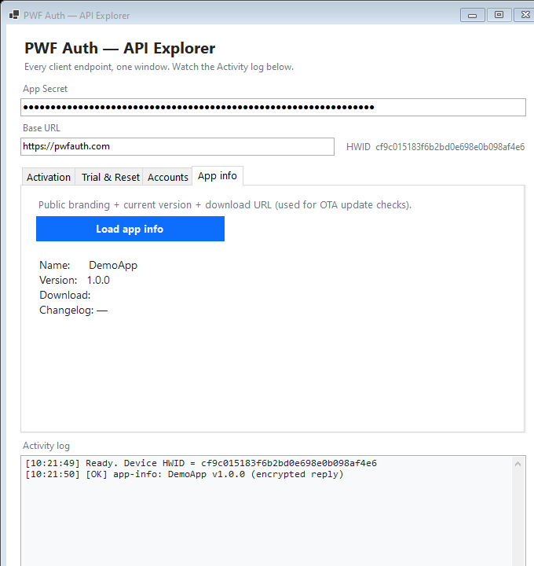
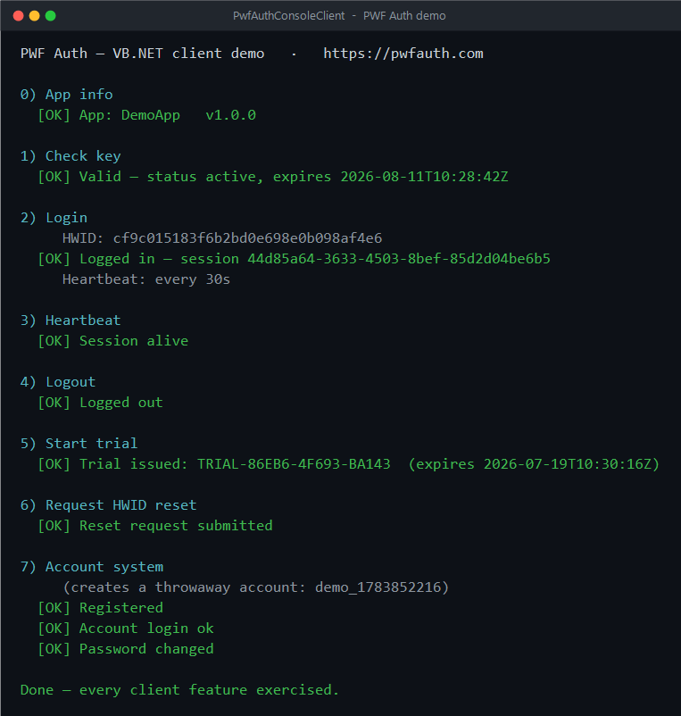

# PWF Auth — VB.NET & C# example clients

<!-- CI badge hidden until the GitHub account's Actions billing is resolved. To restore, delete these comment markers:
[](https://github.com/pwfauth/pwfauth-vbnet-examples/actions/workflows/build.yml)
-->


Self-contained **VB.NET** and **C#** example clients that show how to talk to
**[PWF Auth](https://pwfauth.com)** — a free backend for license keys, end-user
accounts, and OTA update checks behind one REST API. Between them they exercise
**every client-facing endpoint**.



> `PwfAuthWinFormsClient` — the tabbed **API Explorer**: every endpoint is one
> click, and each request/response is written to the live activity log.



> `PwfAuthConsoleClient` — a single guided run exercising every endpoint
> (`login` / `heartbeat` / `logout` travel encrypted).

| Project | What it shows |
| --- | --- |
| [`PwfAuthConsoleClient`](PwfAuthConsoleClient) | A guided command-line run through **every** endpoint: app-info, check-key, login → heartbeat → logout, trial, HWID-reset, and the account system (register / login / change-password) |
| [`PwfAuthWinFormsClient`](PwfAuthWinFormsClient) | The same features as a desktop **"API Explorer"** — a tabbed Windows Forms window with a live activity log |
| [`PwfAuthCSharpClient`](PwfAuthCSharpClient) | The console demo ported to **C# on .NET Framework 4.8.1** (classic crypto / JSON APIs) for legacy apps |

Both are dependency-free (no external NuGet packages) and each folder is
self-contained: it carries its own copy of the client so you can drop a single
project into your solution.

| File (in each project) | Role |
| --- | --- |
| `PwfAuthClient.vb` | The client — one method per endpoint |
| `CryptoEnvelope.vb` | AES-256-CBC + HMAC-SHA256 envelope — byte-for-byte compatible with the server's `PayloadCrypto` |
| `Hwid.vb` | A stable per-machine hardware id sent at login |

The `PwfAuthCSharpClient` project mirrors the same three files as `.cs`, rewritten
against the classic .NET Framework crypto/JSON APIs.

`check-key`, `trial`, `request-hwid-reset`, and the account endpoints send/receive
plain JSON; **`login` / `heartbeat` / `logout` require the encrypted envelope**,
and `app/info` returns one.

## Requirements

- .NET SDK 8.0 or newer (`dotnet --version`)
- For `PwfAuthCSharpClient`: the **.NET Framework 4.8.1** targeting pack (ships with
  Visual Studio; the build also restores it via NuGet)
- A free PWF Auth account and an app — create one at <https://pwfauth.com>

## Configure

Set your app secret with an environment variable (recommended — never commit it):

```powershell
setx PWF_APP_SECRET "your_app_secret_here"
```

Optional: `PWF_BASE_URL` to point at a different host (e.g. a staging server).
In the WinForms app you can also type both values into the fields at the top of
the window.

## Run

```powershell
# Console — pass the key as an argument, or run with none to be prompted
dotnet run --project PwfAuthConsoleClient -- PWF-XXXX-XXXX-XXXX

# Windows Forms
dotnet run --project PwfAuthWinFormsClient

# C# on .NET Framework 4.8.1
dotnet run --project PwfAuthCSharpClient -- PWF-XXXX-XXXX-XXXX
```

## Security note

An App Secret ships inside any client app and can be extracted from the binary,
so treat client-side license checks as a **deterrent, not DRM**. Keep the secret
out of source control — use the `PWF_APP_SECRET` environment variable above; the
in-code default is intentionally blank.

## License

MIT — see [LICENSE](LICENSE).
