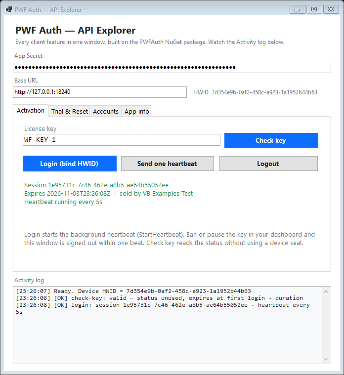
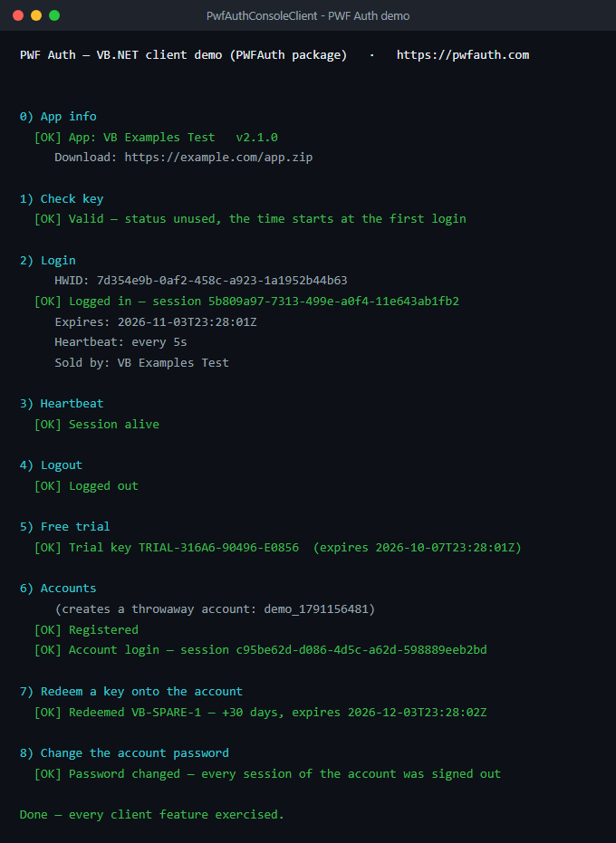
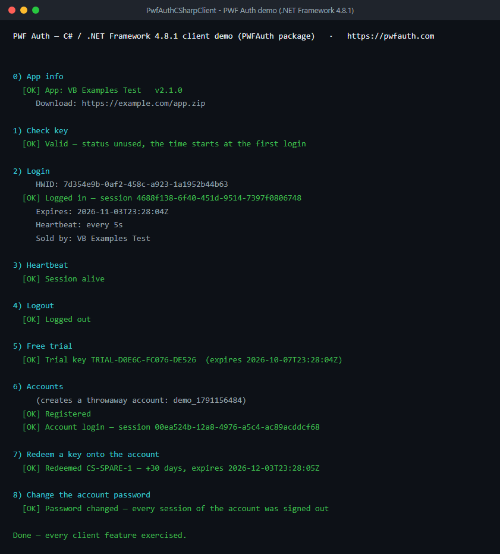

# PWF Auth — VB.NET & C# example clients

<!-- CI badge hidden until the GitHub account's Actions billing is resolved. To restore, delete these comment markers:
[](https://github.com/pwfauth/pwfauth-vbnet-examples/actions/workflows/build.yml)
-->

**VB.NET** and **C#** example clients for **[PWF Auth](https://pwfauth.com)**, a
free backend for license keys, end-user accounts and update checks behind one REST
API. All three are built on the official
**[PWFAuth NuGet package](https://www.nuget.org/packages/PWFAuth)**, so each
example is just the calls you would write in your own app.



> `PwfAuthWinFormsClient` is the tabbed **API Explorer**. Every feature is one
> click, the background heartbeat runs after login, and every reply goes to the
> activity log.



> `PwfAuthConsoleClient` is a single guided run through every feature.



> `PwfAuthCSharpClient` is the same run in **C# on .NET Framework 4.8.1**. The
> package targets netstandard2.0, so it works in older apps too.

| Project | What it shows |
| --- | --- |
| [`PwfAuthConsoleClient`](PwfAuthConsoleClient) | VB.NET on .NET 8. A guided command-line run: app info, check key, login (and moving a license to this PC), heartbeat, logout, free trial, accounts, redeeming a key onto an account, and changing a password |
| [`PwfAuthWinFormsClient`](PwfAuthWinFormsClient) | VB.NET on .NET 8. The same features in a tabbed **"API Explorer"** window, plus the background heartbeat (`StartHeartbeat` + `SessionEnded`) and the update check |
| [`PwfAuthCSharpClient`](PwfAuthCSharpClient) | The console run in **C# on .NET Framework 4.8.1** |

## What the package does for you

```vb
' One client for the whole app: it holds the session and runs the heartbeat.
Private ReadOnly _client As New PwfClient(Environment.GetEnvironmentVariable("PWF_APP_SECRET"))

Private Async Sub btnLogin_Click(sender As Object, e As EventArgs) Handles btnLogin.Click
    Dim login = Await _client.LoginAsync(txtKey.Text)
    If Not login.Success Then MessageBox.Show(login.Message) : Return
    _client.StartHeartbeat()    ' raises SessionEnded on a ban, pause, expiry or reset
End Sub
```

- **Encryption.** It encrypts the requests that must be encrypted (login,
  heartbeat, logout, check key, app content) and refuses a reply that claims
  success without encryption.
- **Hardware id.** It binds licenses to this computer.
- **Wrong clocks.** It repairs a wrong PC clock by itself.
- **Kill switch.** It runs the heartbeat that obeys your kill switch.
- **Moving a license.** `ResetHardwareIdAsync` moves a license to a new PC, with
  your app's cooldown.
- **Accounts on keys.** `RegisterAccountWithKeyAsync` and `RedeemKeyAsync` cover
  accounts that run on license keys.

Earlier versions of these examples carried their own hand-written client. They
now use the package, so they get every server change and fix with a package
update.

## Requirements

- .NET SDK 8.0 or newer (`dotnet --version`)
- For `PwfAuthCSharpClient`: the **.NET Framework 4.8.1** targeting pack. It ships
  with Visual Studio, and the build also restores it through NuGet.
- A free PWF Auth account and an app. Create one at <https://pwfauth.com>.

`dotnet build` restores the `PWFAuth` package from nuget.org automatically.

## Configure

Set your app secret with an environment variable (recommended — never commit it):

```powershell
setx PWF_APP_SECRET "your_app_secret_here"
```

Optional: set `PWF_BASE_URL` to point at a different host, such as a staging
server. In the WinForms app you can also type both values into the fields at the
top of the window.

## Run

```powershell
# Console — pass the key as an argument, or run with none to be prompted.
# An optional 2nd key (UNUSED — it gets used up) shows redeeming a key onto an account.
dotnet run --project PwfAuthConsoleClient -- PWF-XXXX-XXXX-XXXX [PWF-SPARE-KEY]

# Windows Forms
dotnet run --project PwfAuthWinFormsClient

# C# on .NET Framework 4.8.1
dotnet run --project PwfAuthCSharpClient -- PWF-XXXX-XXXX-XXXX [PWF-SPARE-KEY]
```

## Security note

An App Secret ships inside any client app and can be extracted from the binary,
so treat client-side license checks as a **deterrent, not DRM**. Keep the secret
out of source control: use the `PWF_APP_SECRET` environment variable above. The
in-code default is intentionally blank.

## License

MIT — see [LICENSE](LICENSE).
